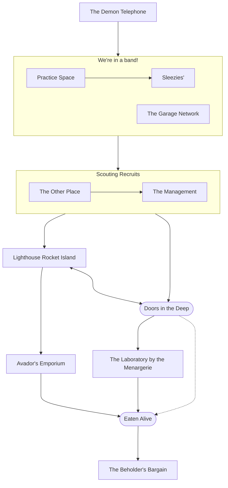

# Plot Paths

## The Demon Telephone

Begin the session with each character having the same dream:

>You walk through a door into a dark void. In the darkness you see a small red light.
>
>You find that it's the only thing in view. No matter how you turn, it is front and center.
>All you *can* do is move closer. Even moving away seemingly moves you closer. To the red light. on the plastic nose. of a toy telephone.
>
>It's plastic, blocky, and features a large primary color smiley face, anthropomorphizing the phone, like many other child's toys.
>But it's ringing with the same tone as *your* phone.
>
>You reach down for your pocket, and
>upon picking up the receiver on the child's phone, which you do not remember doing, you hear a deep throated laugh emanating from the darkness around you.
>You cautiously press your ear to the receiver, and the voice slides into the static-y chuckle that seeps out of where a speaker might be on the plastic, if it were a real phone.
>
>Then, as the crunchy laugh is lost in the static, you are then physcially sucked in.
>through the plastic not-speaker
>like pork in a sausage grinder.
>
>Through the speaker and into the not-circuitry you go.
>As you lose yourself in the static, you swear you can hear music. Something that sounds familiar;
>something you can almost imagine playing yourself;
>and then you awake in a feverish sweat...

## We're in a band!

Your characters must all be in a band.

For whatever reason you'd like, but you are in a band, and at bare minimum, that means you want to make cool music together.

That means you each have some instruments, some talent with them, and you just went in together on the rent for a studio practice space to play in regularly.

The investment is about as much as a phone bill, but if you play at the local sleezy venue, you'd be able to make that back.

Maybe you even have a set list in mind!

Now you need a venue. An audience!

### Practice Space

### Sleezies'

Even though it's a trash heap, Sleezies' has that one guilty pleasure you never tell anyone about. No one judges you there, because everyone has their own, but it's never quite felt welcoming.

## Scouting Recruits

A tinker arrives! In their time and place, whatever it may be, a flamboyant, gaudy character, bedecked in fripperies and whirly gigs, arrives out of the sky on a floating city of a ship!

Is it in immediate response to your need? Did you fall in fate's graces, or is this after months of plotting and planning. Toiling and perfecting?

Were they looking for you in particular?

### How do they respond?

The tinker should be able to approach each character directly with a proposal that they would love to take. All together he will offer to be their manager, but they don't have to take the offer. The offer will find them. *booga booga*

#### Follow the recruiter

Trust is promoted initially. Following the recruiter leads to fun places with fun allies. He will show you around the floating city, make introductions, and generally provide easy connections to anything the group wants, if it is within his power.

This should be a priming. Everyone with magic should be using it freely, but the players cannot yet.

#### Investigate the recruiter

If you don't follow the recruiter, a door will appear to you at some point in the deep. It often appears rusted, and encrusted with barnacles and algea, though it does not squeak and feels as smooth to the touch as any other.

You will hear whatever you desire on the other side of it. In this case, probably a cheering crowd listening to a song you play, but can't quite make out or remember. You feel a longing for the contents.

If a character possesses some weapon or malice, the door appears to them as dripping with water that does not get things wet. As if a sheet of water pours over the top rim of the door.

Only they can see this, and the character finds that everything except the malice in their physical heart, or the weapon, passes easily. They must let go of both to enter the laboratory.

#### Run away

If you get one that just doesn't cooperate, doesn't take plot hooks, and generally wants to be an adversary, eat them anyway.

Start with the reaction above where the players see a door appear. The door from above keeps appearing to them until everyone in the party can see it.

The door will appear, and they will run. The door will be every door until they walk through. If they never use doors again, it becomes all arches and windows, until every gateway has water pouring out of it that only the party can see.

This kind of stuff escalates until the time for this section is over. At that point the kid gloves are off.

The moon's "foot" (think clam's foot) literally peels across time and space, pierces the clouds and drops out of the sky. This has got to be as big around as (have the cross sectional area of) a city block. The sky lights ablaze and the water begins to boil and steam, waves crashing higher than buildings.

This is no longer a hallucination. Hand forced, the beholder will use a legendary action to bend reality to it's will for all to see, and grab the team out of their world corporeally.

The foot is like a moving, stretching tunnel of flesh, endlessly vomiting the tip of a tentacle capped in a cloud of teeth and spines the size of trees.

It progresses like a bullet train, a rocket, thrusting through the clouds like an asteroid. The tunnel craters over the troublemakers at the epicenter, and for a moment, from below. The teeth look like an iris.

But it is like a skyscraper, crashing over them and taking bystanders, vehicles, animals and other buildings.

Grabbing them all in its maw, and forcing them into a tunnel to the demon avatar.

## Lighthouse Rocket Island

#### Fighting the Door

If they run at the door, or test this condition too hard, with malice or otherwise, the water will slowly spray in thinner and thinner streams like a shower head, until a crystallized set of teeth appears around the door that **all** can see.

At this point the door will animate and pull a "forbidden temple" from aladdin.

In a booming voice that echoes through your skull: "Who dares enter here with malice in their heart?! You wish to meet your maker, and so it shall be done!"

Then the door will stretch out of the hallway like a mouth, and literally eat the offending players, who are then propelled forward to the bargain of the demon avatar.

### Tunnel of the Demon Avatar

