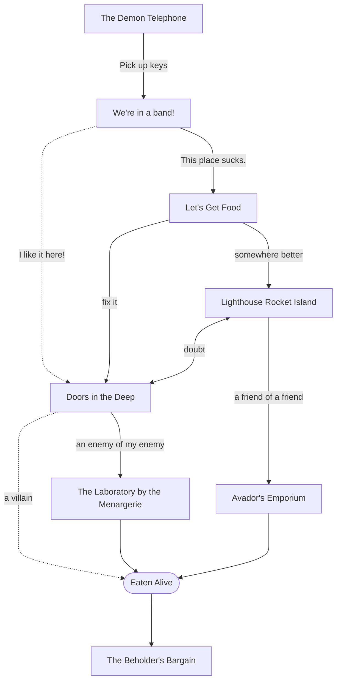
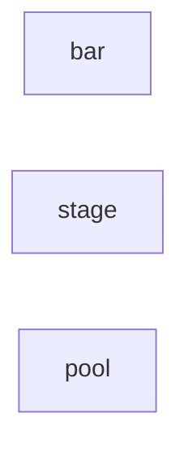

# Plot Paths

3 Sections:

- Intro (1 arc)
	- Demon Telephone (10 min)
	- We're in a band! (25 min)
	- Let's Get Food (25 min)
- A Choice (1.5 hours)
	- Lighthouse Rocket Island (15-30 min)
		- Avador's Emporium (45-60 min)
	- Doors in the Deep (15-30 min)
		- The Laboratory by The Menagerie (45-60 min)
- Eaten Alive (10 min)
	- The Beholder's Bargain (20 min)

## The Demon Telephone

Years ago, NASA predicted a meteor due to pass between the Earth and the moon. Forgotten by everyone but a small nerdy subset of the astronomical community, this event has now come to pass.

Begin the session with each character having the same dream:

>You walk through a door into a dark void. In the darkness you see a small red light.
>
>You find it's the only thing in view. No matter how you turn, it is front, and center.
>All you *can* do is move closer. Even moving away seemingly moves you closer. To the red light. on the plastic nose. of a toy telephone.
>
>It's plastic, blocky, and features a large primary color smiley face, making the phone look like it has agency, like many other child's toys.
>But it's ringing with the same tone as *your* phone.
>
>You reach for your phone, and
>upon picking up the receiver on the toy,
>which you do not remember doing,
>you hear a deep throated laugh emanating from the darkness around you.
>As it fades, you cautiously press your ear to the receiver, and the voice slides into a static-y chuckle.
>It seeps out of where a speaker might be on the plastic, as if it were a real.
>
>Then, as the crunchy laugh is lost in the static,
> you sense a shift, like everything is suddenly made of plastic, and then you are then physically sucked in
>through the phone like pork in a sausage grinder.
>
>From the legs up you are cubed, ground, and begin to feel your ego decompose.
, scream as the pain begins to shoot through you the speaker and into the not-circuitry you go.
>As you lose yourself in the static, you swear you can hear music. Something that sounds familiar;
>something you can almost imagine playing yourself;
>Then the pain begins and as you begin to scream,
>you jolt awake in a feverish sweat...

## We're in a band!

>Your characters must all be in a band.
>
>For whatever reason you'd like, but you are in a band, and at bare minimum, that means you want to make cool music together.
>
>That means you each have some instruments, some talent with them, and you just went in together on the rent for a studio practice space to play in regularly.
>
>The investment is about as much as a phone bill, but if you play at the local venue twice a month, you'd be able to make it back.
>
>So, choose your instrument! Find a personality, a character! What influences them?. What types of music do they listen to and when? What's their guilty pleasure music? Their guilty pleasure generally?
>
>Do they play the same music they listen to?
>
>What does your music say to the world? Are you aware of that voice?
>
>Now you need a venue, and an audience to hear you!

### Practice Space

>A old storage unit building that went defunct. Now the new owner has slapped acoustic foam in all the windowless units.
>
>The whole place is lit with harsh flourescent bulbs. Thank God it's air conditioned, or it would be even more of a nightmare factory.
>
>Each band member shows up to receive their keys to the unit on the day the lease starts.

Roll to see what order people show up in, and describe them parking, or walking in from the bus stop walkway, where there is a seemingly homeless dude with a shopping cart mooching weed.

What do you do at the space? Do you play together? Anyone can have anything on their character's person if they can justify how and why their character is carrying it.

>It's the end of the day. Everyone always goes to the same neighborhood bar. It's the only place less than a half hour away that isn't a movie theater or park. Those have their uses, too, but no one needs a hook up, in either of the ways those places imply.
>
>Today is for simple comforts, easy living, and not too many questions. Today is one more night for Sleezies'

### The Only Bar in Town

Pick your favorite name for a dive bar, and describe it as something like the following:

>Even though it's a trash heap, it has just enough of what everyone needs. That one guilty pleasure you never tell anyone about.
>Nothing too harmful, just shrouded in a bit of mystery and undue shame.
>
>The first things you notice upon walking in the front:
> - A few locals drinking and playing pool.
> - An empty stage with a dusty PA system
> - The bartender hanging at the back explicitly *not* eyeing you as you walk in.
>
>No one judges you here. Everyone has their own poison.
>But it's never quite felt *welcoming*, per say. It's always a bit rough, sometimes to the point of hostility.
>
>Probably because there isn't a proper kitchen.
>People get weird late at the night without food.

The point of this bar is to make characters want better, to want more.
Everything should be usable, but jank or in some way mildly off-putting.

What happens in the bar? Take notes.

#### Get me outta here!

>Everyone needs to eat sometime, but this godforsaken town doesn't have a restaurant that stays open past 8.
>
>The band's energy has to come from somewhere, and food trucks roam the streets like gazelle.
>The only question is preference.
>What are we in for today?

They may not go for a food truck, and end up at someone's house, or trying to drive to a different town.

The location hopefully doesn't matter too much. The scout is going to come. They bring extravagance.

Wherever your characters end up, imagine what extravagance looks like to each of them. The scout will try to omnipotently anticipate these needs through you, the administrator, like the opposite of a boggart.

In food truck land I might imagine a foot-pedal-powered mobile cocktail bar with a slider grill in the center, hibachi style, and decorated with fairy lights and frilly bits like Cinderella's carriage meets Willy Wonka.

-----

- A house, where they get more backstory interactions, and maybe see a gnome
	- Nowhere to play music at any of the houses: hence the need for a practice space.
	- They unknowingly have access to "the garage network" through personal parking spaces
- The grocery store, a 24hr spot where you can get the basics.
	- They have a really good butcher though. He knows things, and always seems to be there, even when he probably shouldn't be.
- the competing bar with a dedicated band and a bit of a mob/gangster feel.

If they go to the competing bar, make the music being played the ones that all the characters hate.

At some point the group will get hungry and go looking for food.

## Scouting Recruits

For a second the group thinks they all saw something, but no, this is a thing. One of you might have seen some on a news special or something if they ask about it.

It's decorated with a circus motif, featuring the cart itself being a birdcage on wheels. They've done a very convincing job of making the outside look like a wire frame version of Cinderella's pumpkin carriage.

The checkout counter is framed like a pendulum bar the bird might stand on.

If they are looking more intently, describe a sign on the front of the carridge, painted like a scroll of parchment, announcing the following:

>I play a song for a dollar,
>and my riddles are a nickel.
>With you it will be a fancy,
>if your interests keep me tickled.
>
>I love the people and the places
>my journeys pull me towards.
>If you're ever in a cage,
>call on me, "Avador". ;)

Is it in immediate response to your need? Did you fall in fate's graces, or is this after months of plotting and planning? Toiling and perfecting?

How long were you looking for food? Was it looking for you too? In particular?

When you see regular text, I want to make a point that this is information intended for the administrator, and not to be verbalized to the players. So for instance, when I write passages in this style, I mean it for you as a reader to explain what is going on in more details than the players will have without interacting with them.

You probably should read the section in advance to know the context for the characters before you actually do anything with the players.

The music begins. (Play some epic buildup music, in the style the characters like, and be ready for the drop, or an explosive hit.)

On the other hand, when you see passages like the following, they are intended for the players. In the (Given Voice), if listed, verbalize the dialogue, describe the situation, paraphrase the passage, and make up fun details as required.
(You may need to take notes on the responses and variety to these things, so be ready for that too.)

(Narrator)
>There is music playing from within the cart,
>It is epic, and has an obvious breakpoint arriving.
>
>Rrainbow lights start to flash and neon bulbs glow in a rainbow of colors around the wires of the cage.
>The decorative elements seem to take life as some form of animatronics make everything flap and wave in a breeze that isn't there,
>
>and with a FLASH! and a BANG! Smoke steams out of the cracks! and the side door of the food truck EXPLODES open, seemingly unharmed.
>The sound of the music is suddenly louder than LIFE!
>
>They emerge!
>
>And it is most definitely a "they", dear friends.
>This... person... is in full transvestite garb!
>Full on Dr. Frankenfurter!
>In a moment it takes you a second to realize you are still in front of a food cart that is schlepping for... burgers?
>A picture of a canarary between two buns you did not notice is emblazoned on the side of the truck.

(The Silliest Voice You Can Muster)
>"Sliders! dear friend, sliders! eh hmm... my my.
They hit the truck like tilting a pinball machine, and a large parchment menu unfurls on the side of the truck.
> Sliders in-deed. Ready to sliiide in... to whatever needs you have baby. ;3*

A swift kick to the truck, and a menu unfurls, dropping flowers and confetti.

If at any point anyone asks this person's name,
(Narrator)
>They make a show of an exasperated sigh, as if this was the most droll question anyone could muster.
>
>They then go to the side of the food truck they came out of (the side with the generator), make a special knock,
(make one up)
>and then walk in with a flair after the door clicks open.
>It swings slowly closed like an old screen door, squeaking the whole way, and shutting with a SLAM!
>
>Then, from inside the food truck, a gaunt, skinny man with a huge bald patch and a ratty tuxedo appears behind the checkout counter.
>Even with the top of his head shining like a grease stain, he wear his long brim of hair below his shoulders, no ponytail or anything.
>Like if Rip van Winkle were a monk and a homeless spy for the government.
>
>Anyway, in round glasses he looks seeming at each of you all at once and says,
(I think of Riff Raff from Rocky Horror Picture show, but you can use any nasally, bored/boring tone. Like a rude teenager being forced to interact nicely with an old person, or a condescending old person being forced to interact with a small child.)
>>helloooooo.

Then wait in awkward silence until someone tries to talk. Have a staring contest if you have to.

If any of the characters try to talk to the cashier, he immediately cuts them off.
>And what can *IIIII* get for *youuuuuu*?

At this point, he will either

- take their order,
- they will try to talk to him, or
- they will go somewhere else.

If they try to give an order
	And they have anything but a good relationship with the previous appearance
		he will type nothing in, take no money, and respond matter of fact-ly after a short pause to think,
>I will see that it is done.

If they try to talk to him in some other way, respond,

(The same bored/boring voice.)
>I'm afraid *I've* taken over this establishment.
>The food is *much better* I assuuuuure you.
>
>I am simply the new...
>chef.

If they try to ask about this or the other character,

(informative, but still a bore.)
>I'm afraid the manager had other business to attend to.
>I'm sure they send their best wishes,
>and they hope you are quite well.

### How do they respond?

The tinker should be able to approach each character directly with a proposal that they would love to take.

>I see I may have caught yall in a moment of...
>hmm hmm hmmmmmm. indecency.
>I do beg your pardon.
>
>Once you have had your.
>*someone in the background moans*
>*the tinker smiles* fill.
>I will see to it that your *other* desires are.
>satisfied.

#### What's in it for you?

Do not bring this up if not prompted, but if the characters are trying to leave, they will present this as the reason they must not. They will reveal it if asked, they have no reason to conceal this motive. However strange, self-centered, or misguided it may be, it is true and honest, and not harmful in any real way.

>You see, I'm trapped.
>A bit like a genie in a...
>What's the word?
Agree with whatever they attempt to fill in
>Yes, that's it!

>Mr. Hyde won't let my credentials shine!
>Business business business.
>Responsibilities are for the birds. Pfa!
>You humans and your...
>food.
>
>Why can't you power your cells with radiation like the rest of us?

They will then walk away.

All together they will offer to be the band's manager. They don't have to take the offer. The offer will find them. *booga booga*

#### Follow the recruiter

Trust is promoted initially. Following the recruiter leads to fun places with fun allies. He will show you around the floating city, make introductions, and generally provide easy connections to anything the group wants, if it is within his power.

This should be a priming. Everyone with magic should be using it freely, but the players cannot yet.

#### Investigate the recruiter

If you don't follow the recruiter, a door will appear to you at some point in the deep. It often appears rusted, and encrusted with barnacles and algea, though it does not squeak and feels as smooth to the touch as any other.

You will hear whatever you desire on the other side of it. In this case, probably a cheering crowd listening to a song you play, but can't quite make out or remember. You feel a longing for the contents.

If a character possesses some weapon or malice, the door appears to them as dripping with water that does not get things wet. As if a sheet of water pours over the top rim of the door.

Only they can see this, and the character finds that everything except the malice in their physical heart, or the weapon, passes easily. They must let go of both to enter the laboratory.

#### Run away

If you get one that just doesn't cooperate, doesn't take plot hooks, and generally wants to be an adversary, eat them anyway.

Start with the reaction above where the players see a door appear. The door from above keeps appearing to them until everyone in the party can see it.

The door will appear, and they will run. The door will be every door until they walk through. If they never use doors again, it becomes all arches and windows, until every gateway has water pouring out of it that only the party can see.

This kind of stuff escalates until the time for this section is over. At that point the kid gloves are off.

The moon's "foot" (think clam's foot) literally peels across time and space, pierces the clouds and drops out of the sky. This has got to be as big around as (have the cross sectional area of) a city block. The sky lights ablaze and the water begins to boil and steam, waves crashing higher than buildings.

This is no longer a hallucination. Hand forced, the beholder will use a legendary action to bend reality to it's will for all to see, and grab the team out of their world corporeally.

The foot is like a moving, stretching tunnel of flesh, endlessly vomiting the tip of a tentacle capped in a cloud of teeth and spines the size of trees.

It progresses like a bullet train, a rocket, thrusting through the clouds like an asteroid. The tunnel craters over the troublemakers at the epicenter, and for a moment, from below. The teeth look like an iris.

But it is like a skyscraper, crashing over them and taking bystanders, vehicles, animals and other buildings.

Grabbing them all in its maw, and forcing them into a tunnel to the demon avatar.

## Lighthouse Rocket Island

#### Fighting the Door

If they run at the door, or test this condition too hard, with malice or otherwise, the water will slowly spray in thinner and thinner streams like a shower head, until a crystallized set of teeth appears around the door that **all** can see.

At this point the door will animate and pull a "forbidden temple" from aladdin.

In a booming voice that echoes through your skull: "Who dares enter here with malice in their heart?! You wish to meet your maker, and so it shall be done!"

Then the door will stretch out of the hallway like a mouth, and literally eat the offending players, who are then propelled forward to the bargain of the demon avatar.

### Tunnel of the Demon Avatar

