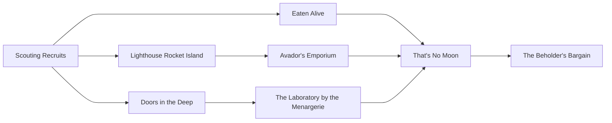

# Lighthouse

This episode centers on the discovery of a lighthouse leading to a different world. My world. A world alien and strange, approaching your world, and quickly.

A force that begs to be heard. Demands it.

A patron.

## Feels

Cosmic scale: "I am small." is the same as "The world is much bigger than I am."

Wonder and awe. The unexpected. Shocks and astounds. Intrigues.
"Just imagine!" "Holy crap." "I'm not sure how I feel about this."

## Death and Separation

The elephant in the room: what do you do if a player calls your bluff? They know they have "plot armor". They will run away from the story, away from each other.

I feel like there needs to be a combination of incentives, deterrants, and systems in place, to either prevent character death, and/or keep the group together.

### A First Idea

What if when you die, you had to "re-apply" to be in the group? However we find players, there is a pool of potential candidates.

Should this be playable for kids? How do you scale it up and down to account for the demographics of your audience?

## Reference

This should touch on themes of pioneering and exploration. What it means to let go and start anew in a foreign place. The things that people go through when that happens. The way people receive them. What they can do about it.

It should start with a group of individuals, and end with a collective group of characters. Not just ready to go on an adventure together, but bound together in some way until they are destined to leave.

They must leave, because there must be an off ramp. I will not play DM for a single group forever, other than any of my own, willing family members, that I know personally.

### I am small. The world is big. What do I do about it?

What media is there that centers on exploration, explorers, and learning? Where will I get my pioneering flavor? The nostalgia that we take with us in a locket as a comfort of the familiar for when things are strange.

- The Magic School Bus
- Star Trek: The Next Generation
- Donnie Darko

### The Lighthouse

How do we get to where we are going? The lighthouse. Why? It's a colored rocket!

Space separates us. An isolated hermit living alone finds what they've been searching for all along: To be relieved from one's post, if only for a while. And I in my kercheif and Ma in her cap, had thus settled down for a long winter's nap.

With sugarplum dreams, we will be ready to wake in spring.

What media has a lighthouse? What flavor and references will come to mind when you mention a lighthouse?

- Bioshock

### Sugarplum dreams in a long winter's nap

There also seems to be some seasonal winter allegories. A moving from the discrete into the cyclic. An inverse Fourier transform.

- "The Night Before Christmas" by Clement Clarke Moore
- Rip van Winkle

### Or is it in the deep?

Do you not seek light and merriment? Is the world full of too many frivolities and fripperies?

Distractions of the soul. You want meat. You may want to rend it yourself. Are you ready?
Maybe a little frippery is ok, but if not, do not fear. I am not afraid to tread in the dark.

- Dark
- Persephone
- Prometheus

If we cannot share this land, we will share the graveyard beneath it.

## Paths

What are the paths in to the world? Whatever they are, they must be "corporeal". They must happen in meat space.

No "beaming", teleporting, or fast-travel is permitted without signing a cloning authorization contract.

This all leads up to a bargain. A way of tying everyone together. Kids? Are they all babysitters?

They are in a band.
First and foremost, we make music together! We're bongo brothers!

Every good band needs a good manager!
