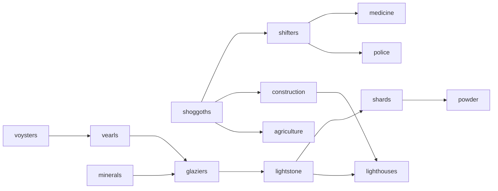
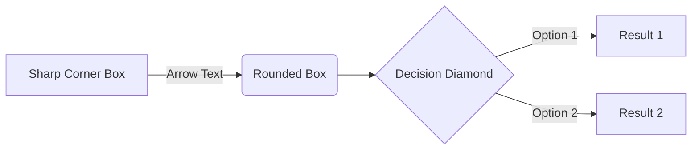

# Roleplay

## Intent

This is one of my more ambitious and long term ideas. I want this as a way to get into the realm of psychology, without going to directly at it. That's what all tabletop roleplaying games turn into after a few months anyway: group counseling with an unqualified peer leader. =P

I have thoughts of understanding personality with this project. Mostly my own, with an intent to preserve it so people would know my character. Who I was and how I interacted with the world after I'm gone. A sort of photo of the mind.

## Inspiration

### Analysis

I am trying to develop an adaptive, text-based, fictional world that "renders" itself around the user to form systematic ways of interacting, rather than just resolving the plot through direct character dialogue.

I always try to learn from those that came before me, so I'm using source material as inspiration that I want to reflect on in depth. I will try to learn the lessons each of these resources attempts to teach, and re-interpret what I can within the broad systems of my own world and its interwoven plots.

So with that in mind, please consider the following questions about each piece of reference material and determine the parts that are relevant:

- What dot the fictional worlds themselves say about the author's view of their own world and their interactions with it? What historical context is there to be had about the author themselves, and what made them create the source material?
- What morals are built into the worlds and their systems rather than the plot?
- What is possible in the world, and at what cost? How do you feed people? How do you survive? Is there agriculture? What technologies are different?
- Who does the world vilify or vindicate? What is daily life like? Is it different fo the divisions of labor? Is there a class system based on religion, ability, wealth, or some other thing?
- Is there a new system of morals or ethics given the fictional twists to how reality works?
- What kind of economy is there and how does it function? Where do resources come from, how are they used, and where does trash go? Sewage and running water? Electricity? Freezers, refrigerators, and air conditioning?
- How do people get around? What is transportation of large quantities of good like? What is used for fuel?
- What about government? Are there nation states? It is total anarchy and free market? What are you allowed to do?
- Past times? What do people like doing in their freetime?

As you consider these things, remember that any change in the way reality works to make it magical or fictional causes ripples throughout the systems of the world involved. There may be minimal changes, but I assume even they are often still far-reaching.

### Flavor

With all that in mind, how are the following achieved? What are the minimal changes to reality that make each of the following unique? Use those changes to answer the above questions for each:

- The wacky fun with dark undertones of Willy Wonka's chocolate factory.
- The utopic exploration of humanity and technology without limits that is Start Trek
- The Weasley's Toy Shop in Harry Potter for its flamboyant realization of people's desires
- The deeply jarring depiction of self-reflective character development and personal change that is Stranger Than Fiction
- The complicated questions of Westworld that lead to the agency and morality of fun, as well as coming to agency from a twisted adversarial system
- The endless, haunting, calm exploration and interlocking depths of Myst
- The twinkling legend in the ruins and the tangled forboding of the lost woods of the "Legend of Zelda" series
- The wonder, intrigue, and lore of Studio Ghibli films
- The foreboding chasm that is House of Leaves

Also use the following, but more for their inspiration of mechanics or style rather than content:

- Just the effects of scale and the simple mechanical fun and awe inducing juxtapositions/transitions from:
  - Kerbal Space Program (the realistic changes of scale, not the building aspects)
  - Shadow of the Colossus (the use of large characters as environment)
  - Katamari Damacy (the collection of small things to make ridiculously larger and larger things)

## Characters

The characters start with the beholder. The hive-mind whose limbs are shoggoths. Itt knows and changes all things within its bounds according to a challenge of wills. It is the most powerful will, forged through eons, and thus all bow down within it's domain (essentially it's digestive start). It now holds the world together in an attempt to be benevolent, while needing to consume like any other living thing.

It wants children, not clones. It wants to find another that is worthy to take on the world. To inherit **the gift**.

- Beholder
  - originator of the pocket dimension
  - hires demons to manage the immortality of the "tenants"
    - twists the demons who disobey and makes mindless shoggoths to build and manage things
    - vampires and other immortals take up shop like parasites preying on the eternal stock
  - finances pirates to set up waypoints, recruit tenents, and expand the empire
  - disguised as a dragon would to peruse their "collection" and take/do what they like
- Avador
  - Explorer, pirate
  - gateway to the game world
- Demons
  - In game fixers meant to keep the people "productive"
  - like all the other immortals in the system, feed on the "tenents" at will
    - are given reign to use the tenants in their eternal war 
- The Scarred Biologist
  - immortality experiments to rival the demons

Light stone ingredients:
- Obsidian
  - The Dragons in the Sand
    - master glaziers and business tychoons that run the operations
    - desire (and have) control of the system of production, and their respective resource pile
    - solitary, greedy nature makes them pawns to the beholder (can't see the bigger picture)
- Pearls of Genetically Modified Oysters
  - The agricultural revolution spawned this innovation, leading to the light stones
  - Grown and managed by oyster "farmers" of sorts that are often more rural.
  - innovations come from a technological elite. Think Mansanto

### Plot

How does it actually work? Diagram or brief overview; save details for additional docs.

## Goals

What is the bare minimum it takes to have a "usable" result? Without an off ramp you're investing in a new lifestyle.

First words, then lists, then diagrams. Think big and prune. Actionable tasks are better than goals.

- [ ] Main thing to do
  - [x] There are always parts to it
  - [ ] More than one thing makes a list
- [ ] Make a follow up task

## Plans

> Remember that *tasks* age like milk, not like wine.

Only **schedule** what is necessary. Ideas go in an "IDEAS.md" file, not the road-map. *Then* select tasks from the pool of ideas.

## Testing

How do you know how well it's going? How do you know where you left off? How do you know if you broke something that used to work fine?

You can't see everything all at once: make unit tests or you'll be in trouble when you come back after a hiatus.

## Dependencies

What technologies does this assume you have installed and how would other people find and install it?

## Layout

I just opened this folder; What is all of it? How are things laid out?

How do I build and run? How do I run unit tests or make changes? How do I file a bug report?

## References

If you need a thing go [to the source](src)!

[src]: www.alwayslistyoursources.com
